# MedAI Hub - System Architecture Documentation

> AI-Powered Systematic Literature Review Platform for Medical Researchers

## Table of Contents

1. [System Overview](#1-system-overview)
2. [High-Level Architecture](#2-high-level-architecture)
3. [Backend Architecture](#3-backend-architecture)
4. [Frontend Architecture](#4-frontend-architecture)
5. [Database Schema](#5-database-schema)
6. [Authentication Flow](#6-authentication-flow)
7. [Tool-Specific Data Flows](#7-tool-specific-data-flows)
8. [External Services Integration](#8-external-services-integration)
9. [Deployment Architecture](#9-deployment-architecture)

---

## 1. System Overview

MedAI Hub is a three-tool platform that streamlines systematic literature reviews:

| Tool | Purpose | Key Features |
|------|---------|--------------|
| **Define** | Research question formulation | AI chat, framework extraction, FINER assessment |
| **Query** | PubMed query generation | MeSH expansion, boolean queries, validation |
| **Review** | Abstract screening | MEDLINE parsing, batch AI screening, human override |

### Tech Stack

```
┌─────────────────────────────────────────────────────────────────┐
│                        FRONTEND                                  │
│  Next.js 15 + TypeScript + Tailwind CSS + Shadcn UI             │
│  Deployed on: Vercel (shaitamam.com)                            │
└─────────────────────────────────────────────────────────────────┘
                              │
                              │ HTTPS (REST API)
                              ▼
┌─────────────────────────────────────────────────────────────────┐
│                        BACKEND                                   │
│  FastAPI (Python 3.11) + LangChain + Google Gemini AI           │
│  Deployed on: Railway (api.shaitamam.com)                       │
└─────────────────────────────────────────────────────────────────┘
                              │
              ┌───────────────┼───────────────┐
              ▼               ▼               ▼
┌─────────────────┐ ┌─────────────────┐ ┌─────────────────┐
│    Supabase     │ │  Google Gemini  │ │   NCBI APIs     │
│   PostgreSQL    │ │   AI Studio     │ │ PubMed + MeSH   │
│     + Auth      │ │                 │ │                 │
└─────────────────┘ └─────────────────┘ └─────────────────┘
```

---

## 2. High-Level Architecture

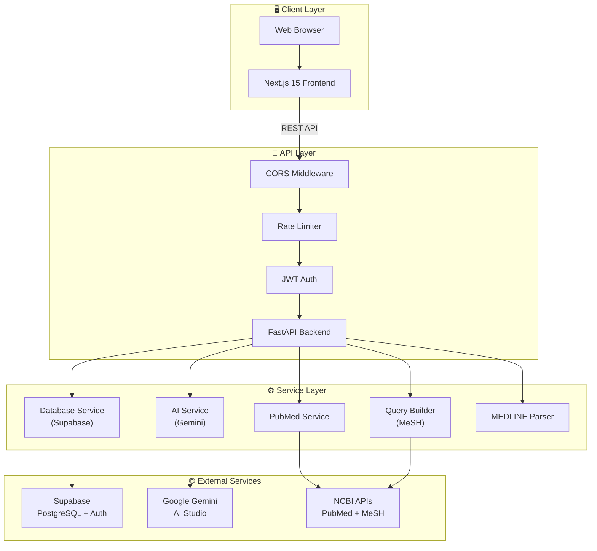

---

## 3. Backend Architecture

### 3.1 Module Structure

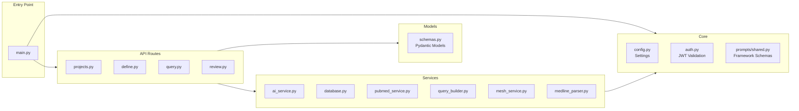

### 3.2 Service Layer Pattern

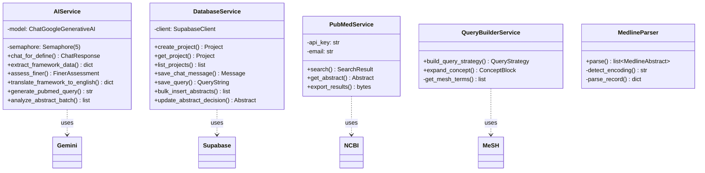

### 3.3 API Endpoints

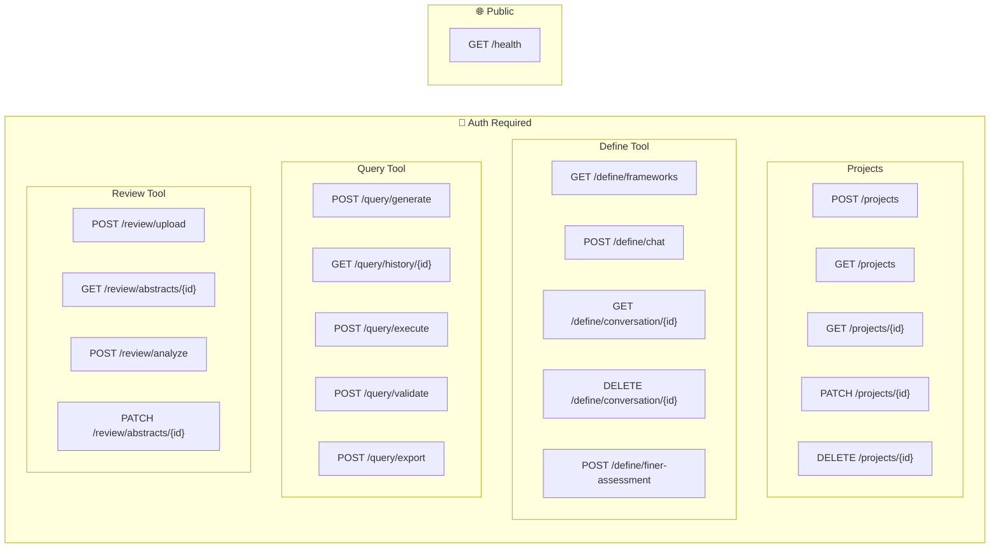

---

## 4. Frontend Architecture

### 4.1 Component Structure

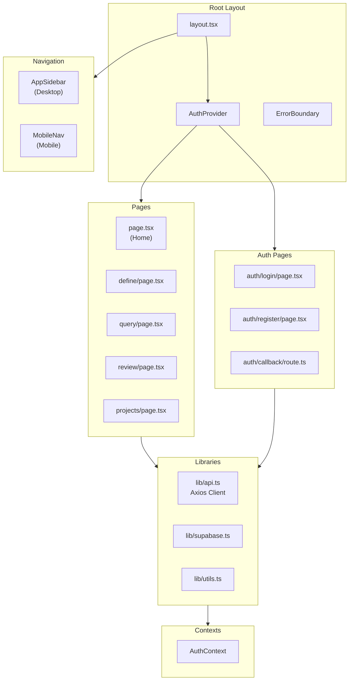

### 4.2 State Management Flow

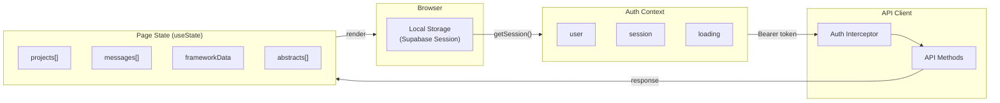

---

## 5. Database Schema

### 5.1 Entity Relationship Diagram

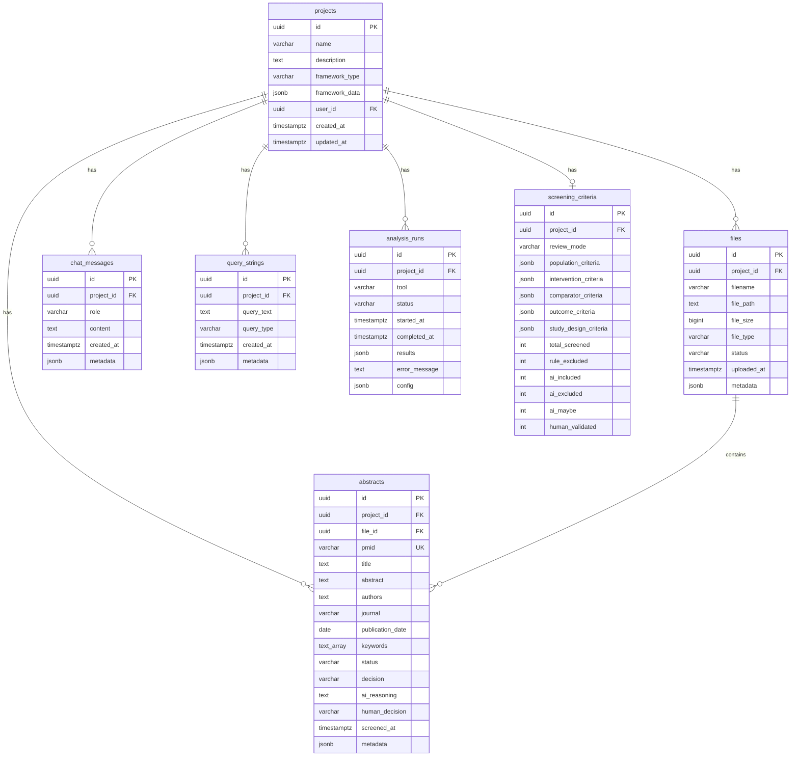

### 5.2 Table Relationships

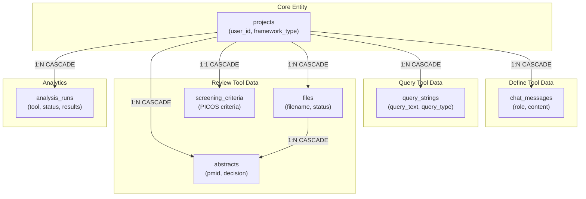

---

## 6. Authentication Flow

### 6.1 Login Sequence

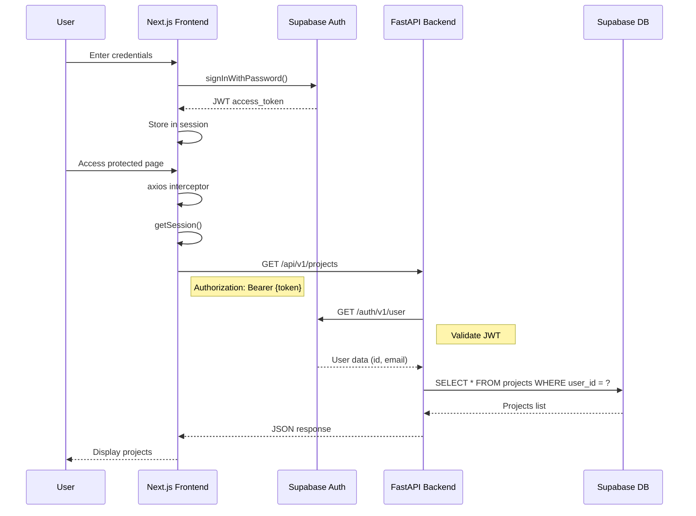

### 6.2 Auth Components

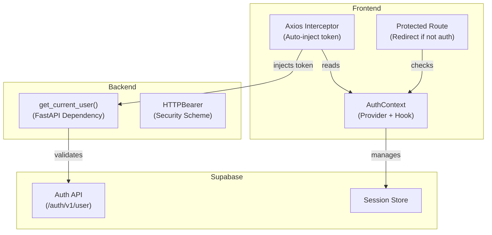

---

## 7. Tool-Specific Data Flows

### 7.1 Define Tool Flow

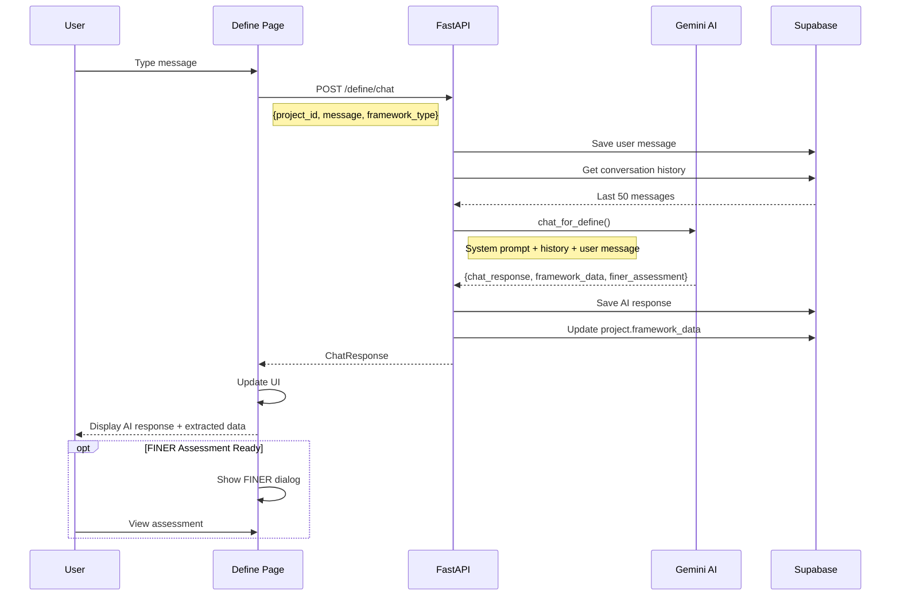

### 7.2 Query Tool Flow

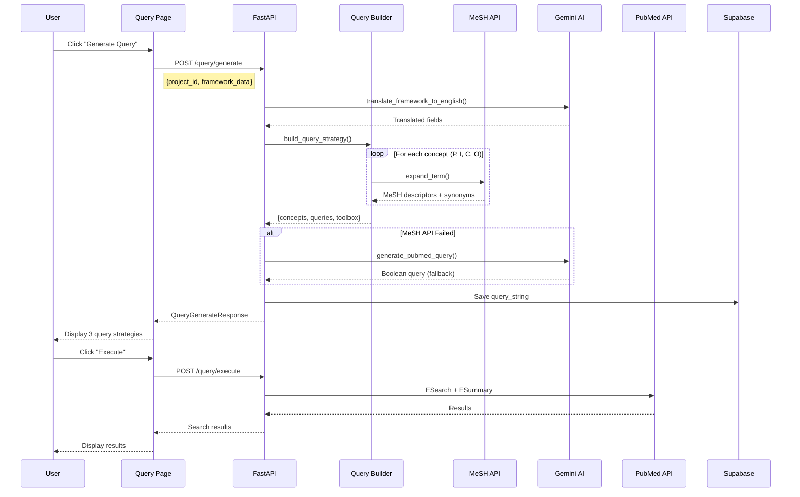

### 7.3 Review Tool Flow

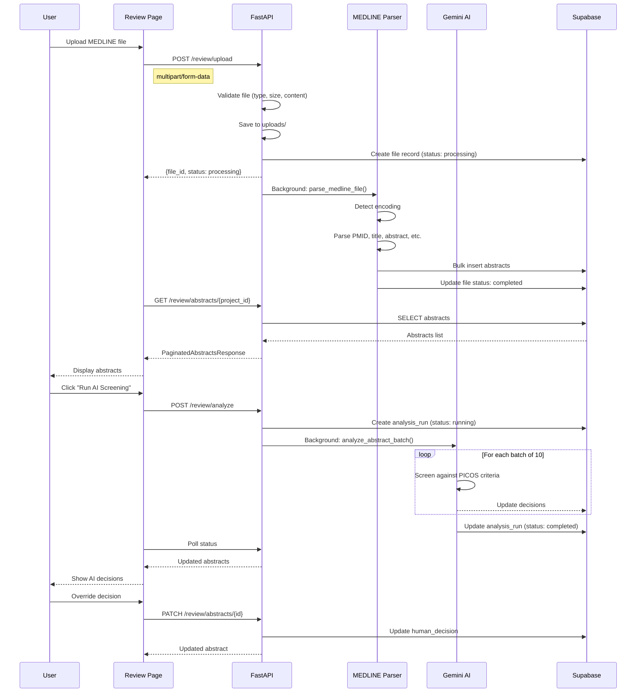

---

## 8. External Services Integration

### 8.1 Service Dependencies

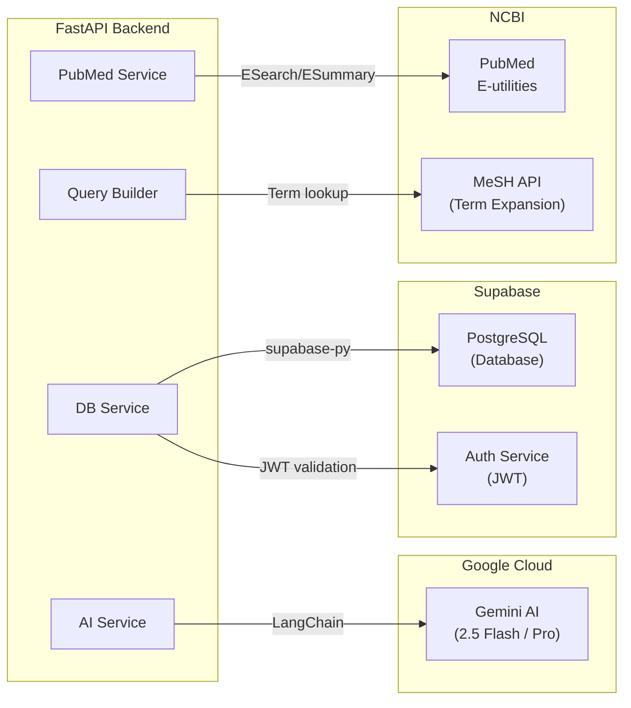

### 8.2 API Rate Limits & Timeouts

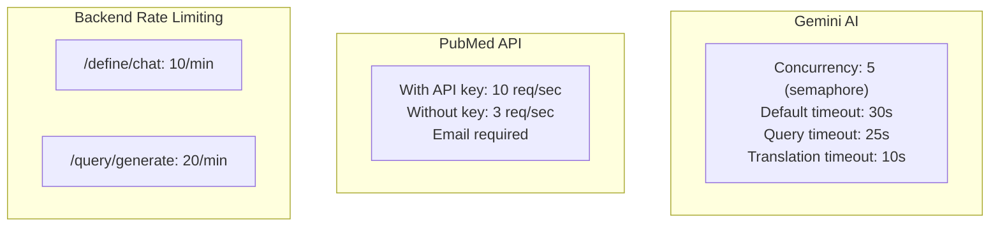

---

## 9. Deployment Architecture

### 9.1 Production Environment

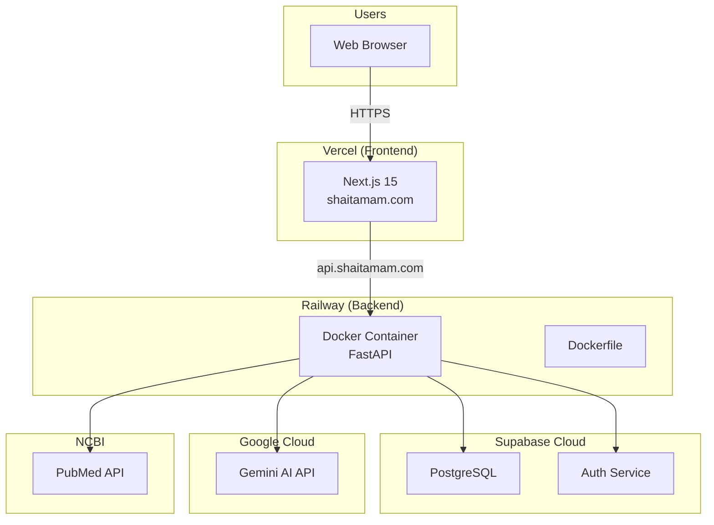

### 9.2 Environment Variables

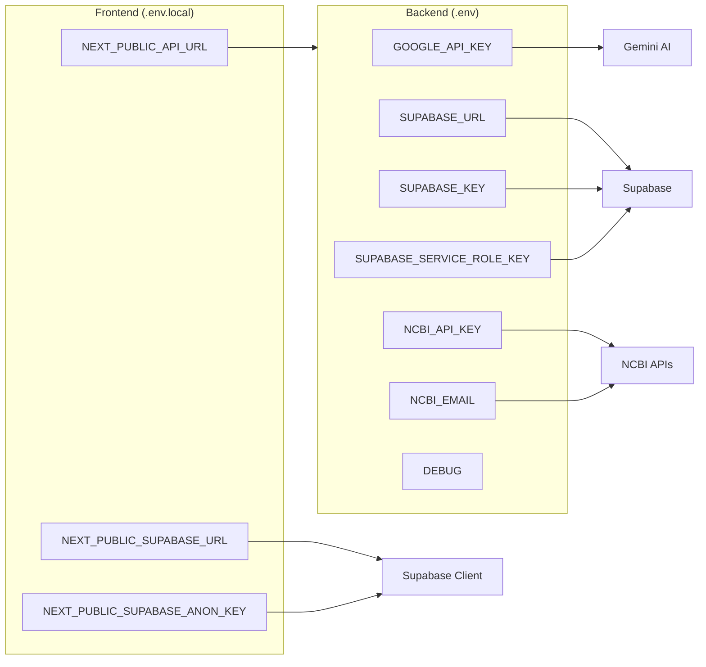

---

## Appendix: Framework Types Supported

| Framework | Use Case | Components |
|-----------|----------|------------|
| PICO | Clinical interventions | Population, Intervention, Comparison, Outcome |
| PICOT | Time-sensitive studies | + Time |
| PICOS | Study design focus | + Study Design |
| PICOC | Context matters | + Context |
| PICOTS | Comprehensive RCTs | + Time + Setting |
| CoCoPop | Prevalence studies | Condition, Context, Population |
| PEO | Qualitative research | Population, Exposure, Outcome |
| PECO | Environmental exposures | + Comparison |
| PCC | Scoping reviews | Population, Concept, Context |
| PICo | Qualitative JBI | Population, Interest, Context |
| SPIDER | Qualitative synthesis | Sample, Phenomenon, Design, Evaluation, Research type |
| SPICE | Policy evaluation | Setting, Perspective, Intervention, Comparison, Evaluation |
| ECLIPSE | Health policy | Expectation, Client, Location, Impact, Professionals, Service |
| CIMO | Management research | Context, Intervention, Mechanism, Outcome |
| BeHEMoTh | Theory frameworks | Behavior, Health condition, Exclusions, Models, Theories |
| PerSPEcTiF | Complex interventions | Perspective, Setting, Phenomenon, Environment, Timing, Findings |
